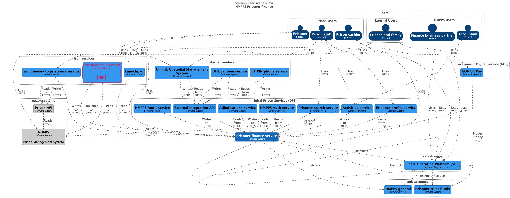
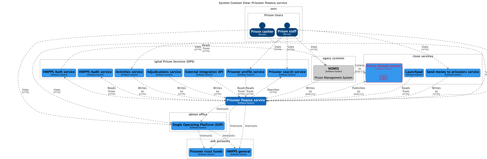
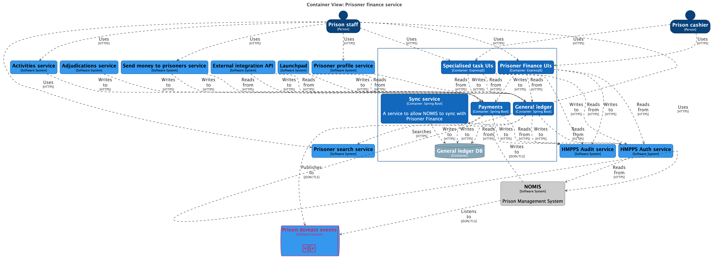
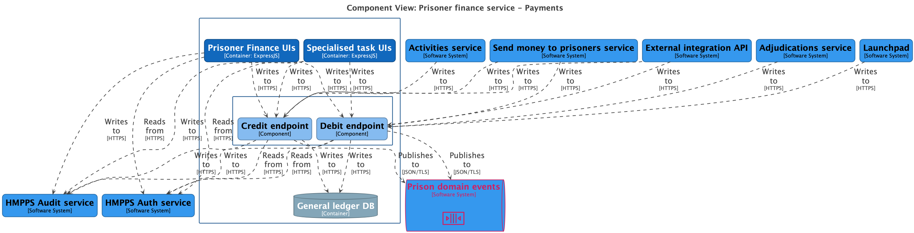
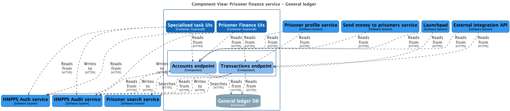
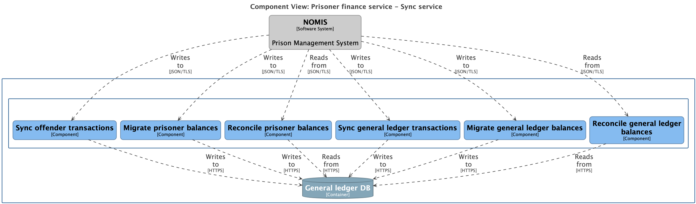
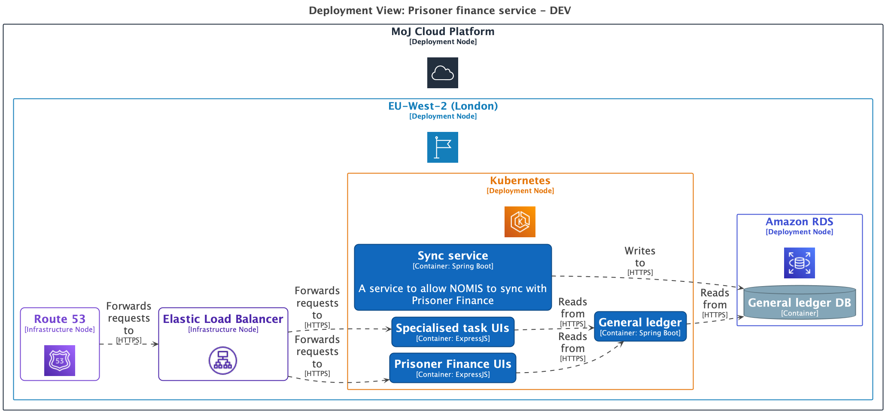

# HMPPS Prisoner Finance Architecture

## getting started

From the root of this repository run the following command to start the structurizr lite web service.

```shell
make serve-architecture
```

this will create a web service available at `http://localhost:8080` which will allow you to explore the workspace.

## Exporting diagrams

To export views to Mermaid, PlantUML and PNG run the following docker command from the root of the codebase;

```shell
make export-architecture
```

The mermaid code can be used directly in Github Markdown;

## Architecture

### System landscape



### System contexts




### Container views



### Component views







### Deployment



