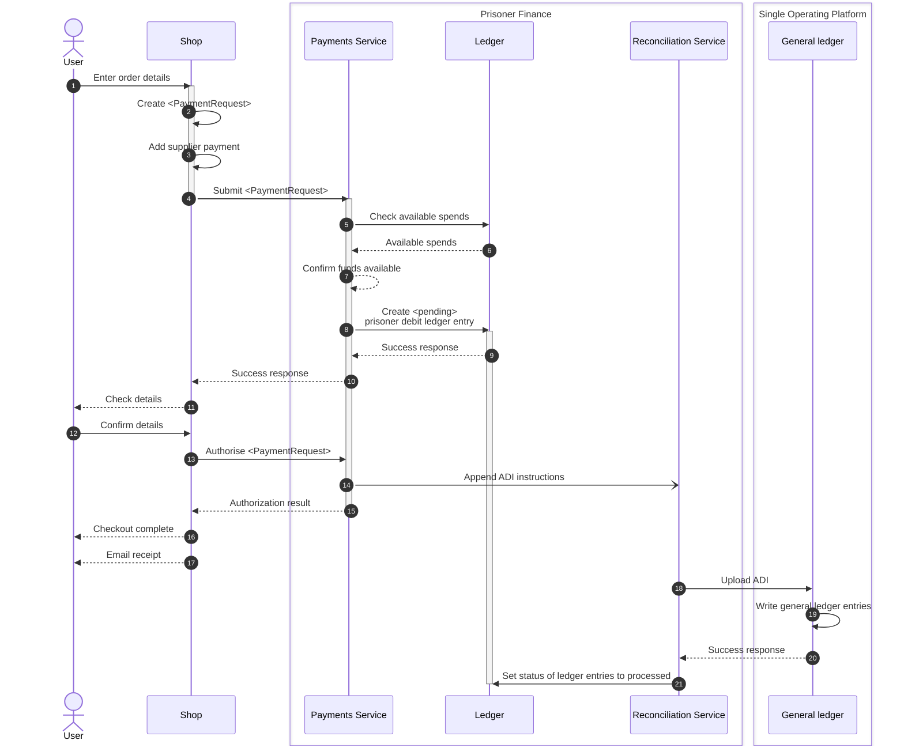
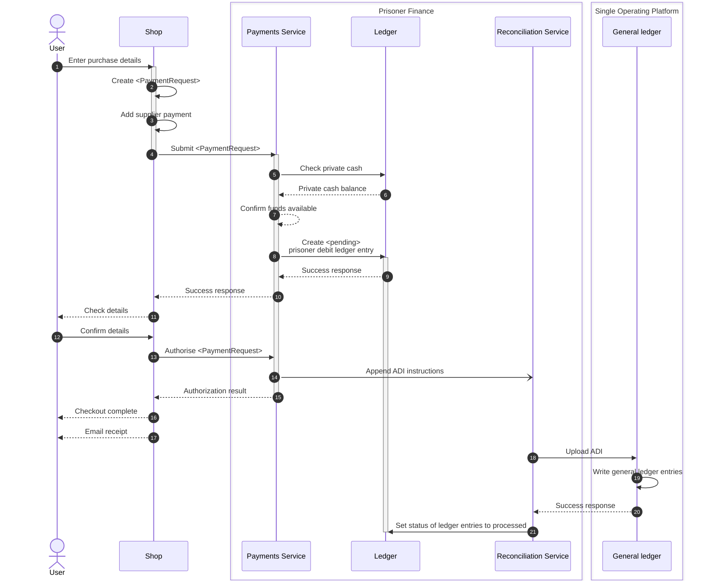
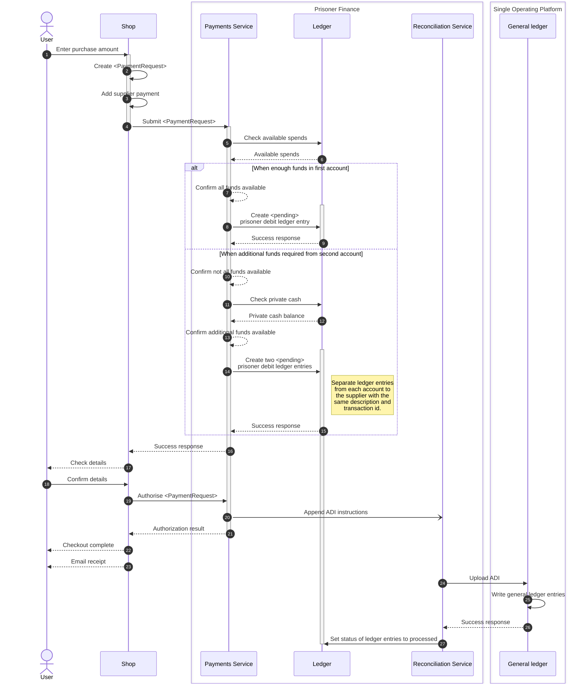
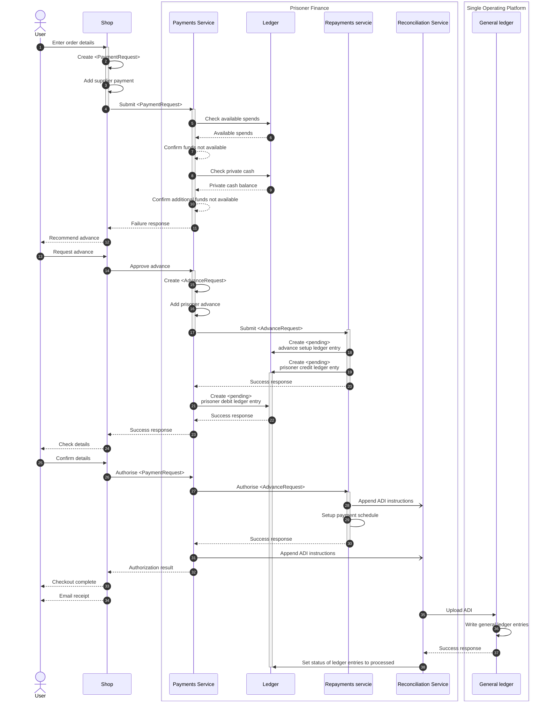
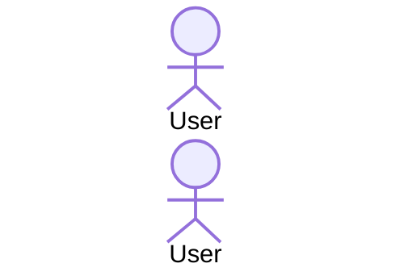
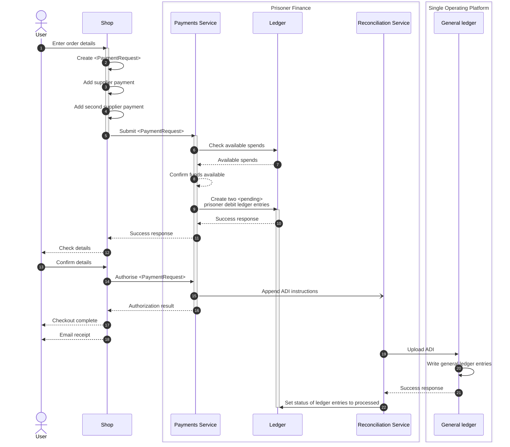
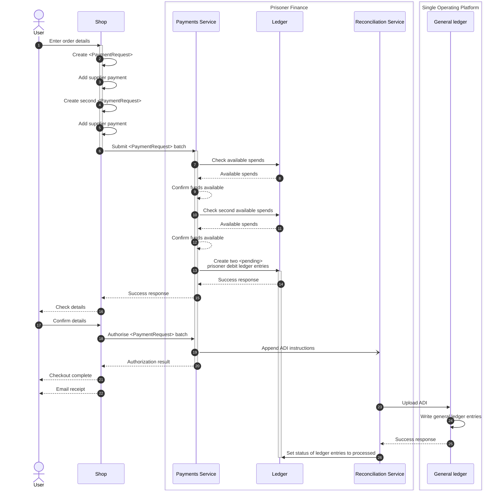
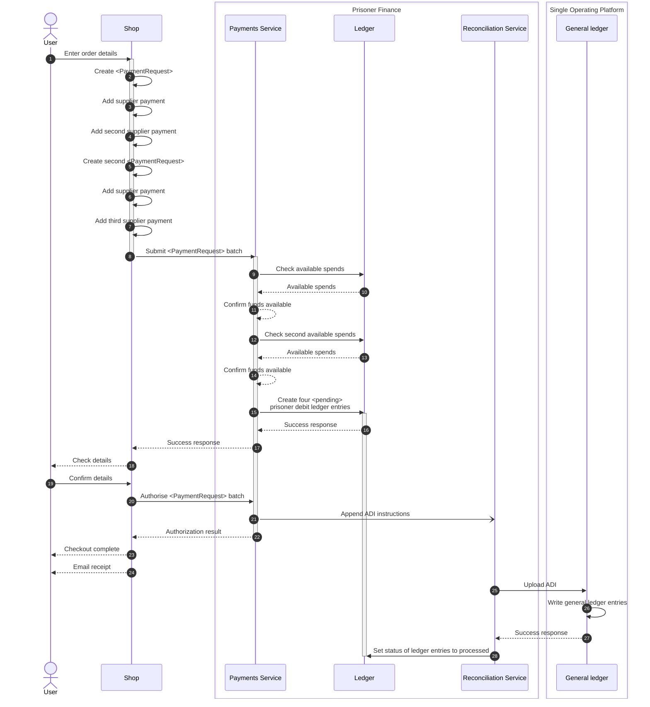

# Purchasing

## Pre-requisites

The shop service will need to set up;

1. Suppliers general ledger account details that will be used to collect payments
2. Accepted payment methods including combination priorities

## Payment scenarios

### Ordering within available spends limit

This would be the most common payment process, it is only effective for a pre-delivery process where the payment is taken before the purchase is fulfilled (such as with Amazon or other ecommerce services). Failure will occur if there is not enough available spends to complete the purchase, even if the person has more funds in their private cash or savings subaccounts.



Example `PaymentRequest` showing one supplier payment to be taken from available spends submitted at step 4:

```shell
curl -X 'POST' \
  'https://dev-payments.prisoner-finance.service.justice.gov.uk/suppliers/CANTEENS-R-US/payment-requests' \
  -H 'accept: */*' \
  -H 'Content-Type: application/json' \
  -d '{
  "orderId": "CANTEEN-0001",
  "requestId": "a1b2c3d4-e5f6-7890-1234-567890abcdef",
  "timestamp": "2024-06-18T14:30:00.123456",
  "personIdentifier": "X9999XX",
  "paymentMethods": ["SPNDS"],
  "caseloadId": "FHI",
  "total": 1.5,
  "payments": [
    {
      "description": "Purchase of goods from canteen",
      "amount": 1.5
    }
  ]
}'
```

Example of ledger entry recorded at step 8:

| entryId | transactionId | date       | source    | destination | description                    | reference    | amount |
|---------|---------------|------------|-----------|-------------|--------------------------------|--------------|--------|
| 123     | 987           | 2024-06-18 | AAA/SPNDS | BBB         | Purchase of goods from canteen | CANTEEN-0001 |    1.5 |

Example of ADI instruction recorded at step 14:

| Upl     | Entity | Cost Centre | Account    | Objective | Analysis | Intercompany | Spare   | Debit | Credit | Line Description                           | Messages |
|---------|--------|-------------|------------|-----------|----------|--------------|---------|-------|--------|--------------------------------------------|----------|
| O       | 6666   | 99999999    | 8888888888 | 0000000   | 00000000 | 0000         | 0000000 | 1.5   |        | Canteen Spends - 09.01.2024 - CANTEEN-0001 |          |
| O       | 4444   | 11111111    | 2222222222 | 0000000   | 00000000 | 0000         | 0000000 |       | 1.5    | Canteen Spends - 09.01.2024 - CANTEEN-0001 |          |
| Totals: |        |             |            |           |          |              |         | £1.50 | £1.50  |                                            |          |

### Recording a purchase from private cash

This process would take place in circumstances where items are not limited to the available spends limit. It is primarily for emergency purchases or items that are not restricted to available spends such as money to friends and family members. Failure will occur if there is not enough private cash to complete the purchase, even if the person has more funds in their available spends or savings subaccounts.



Example `PaymentRequest` showing one supplier payment to be taken from private cash submitted at step 4:

```shell
curl -X 'POST' \
  'https://dev-payments.prisoner-finance.service.justice.gov.uk/suppliers/PHARMAS-R-US/payment-requests' \
  -H 'accept: */*' \
  -H 'Content-Type: application/json' \
  -d '{
  "orderId": "PHARMA-6098-GMI",
  "requestId": "a1b2c3d4-e5f6-7890-1234-567890abcdef",
  "timestamp": "2024-06-18T14:30:00.123456",
  "personIdentifier": "X9999XX",
  "paymentMethods": ["CASH"],
  "caseloadId": "GMI",
  "total": 0.25,
  "payments": [
    {
      "description": "Purchase of medication from pharmacy",
      "amount": 0.25
    }
  ]
}'
```

Example of ledger entry recorded at step 8:

| entryId | transactionId | date       | source   | destination | description                          | reference       | amount |
|---------|---------------|------------|----------|-------------|--------------------------------------|-----------------|--------|
| 123     | 987           | 2024-06-18 | AAA/CASH | CCC         | Purchase of medication from pharmacy | PHARMA-6098-GMI | 0.25   |

Example of ADI instruction recorded at step 14:

| Upl     | Entity | Cost Centre | Account    | Objective | Analysis | Intercompany | Spare   | Debit | Credit | Line Description                               | Messages |
|---------|--------|-------------|------------|-----------|----------|--------------|---------|-------|--------|------------------------------------------------|----------|
| O       | 6666   | 99999999    | 7777777777 | 0000000   | 00000000 | 0000         | 0000000 | 0.25  |        | Pharmacy Spends - 09.01.2024 - PHARMA-6098-GMI |          |
| O       | 4444   | 11111111    | 5555555555 | 0000000   | 00000000 | 0000         | 0000000 |       | 0.25   | Pharmacy Spends - 09.01.2024 - PHARMA-6098-GMI |          |
| Totals: |        |             |            |           |          |              |         | £0.25 | £0.25  |                                                |          |

### Ordering using available spends and additional private cash

This process would take place in circumstances such as dental treatment or where the governor has given permission for the person to spend more than their available spends such as after a compensation payment. Failure will occur if there is not enough available spends and private cash to complete the purchase, even if the person has more funds in their savings subaccounts.



Example `PaymentRequest` showing one supplier payment to be taken from available spends and private cash submitted at step 4:

```shell
curl -X 'POST' \
  'https://dev-payments.prisoner-finance.service.justice.gov.uk/suppliers/CATALOGUES-R-US/payment-requests' \
  -H 'accept: */*' \
  -H 'Content-Type: application/json' \
  -d '{
  "orderId": "CATALOGUE-6098-LVI",
  "requestId": "a1b2c3d4-e5f6-7890-1234-567890abcdef",
  "timestamp": "2024-06-18T14:30:00.123456",
  "personIdentifier": "X9999XX",
  "paymentMethods": ["SPNDS", "CASH"],
  "caseloadId": "GMI",
  "total": 35,
  "payments": [
    {
      "description": "Purchase of items from Catalogue",
      "amount": 35
    }
  ]
}'
```

Example of ledger entry recorded at step 8:

| entryId | transactionId | date       | source    | destination | description                      | reference          | amount |
|---------|---------------|------------|-----------|-------------|----------------------------------|--------------------|--------|
| 123     | 987           | 2024-06-18 | AAA/SPNDS | DDD         | Purchase of items from Catalogue | CATALOGUE-6098-LVI | 5.05   |
| 123     | 987           | 2024-06-18 | AAA/CASH  | DDD         | Purchase of items from Catalogue | CATALOGUE-6098-LVI | 29.95  |

Example of ADI instruction recorded at step 14:

| Upl     | Entity | Cost Centre | Account    | Objective | Analysis | Intercompany | Spare   | Debit  | Credit | Line Description                                   | Messages |
|---------|--------|-------------|------------|-----------|----------|--------------|---------|--------|--------|----------------------------------------------------|----------|
| O       | 6666   | 99999999    | 8888888888 | 0000000   | 00000000 | 0000         | 0000000 | 5.05   |        | Catalogue Spends - 09.01.2024 - CATALOGUE-6098-LVI |          |
| O       | 4444   | 11111111    | 3333333333 | 0000000   | 00000000 | 0000         | 0000000 |        | 5.05   | Catalogue Spends - 09.01.2024 - CATALOGUE-6098-LVI |          |
| O       | 6666   | 99999999    | 7777777777 | 0000000   | 00000000 | 0000         | 0000000 | 29.95  |        | Catalogue Spends - 09.01.2024 - CATALOGUE-6098-LVI |          |
| O       | 4444   | 11111111    | 3333333333 | 0000000   | 00000000 | 0000         | 0000000 |        | 29.95  | Catalogue Spends - 09.01.2024 - CATALOGUE-6098-LVI |          |
| Totals: |        |             |            |           |          |              |         | £35.00 | £35.00 |                                                    |          |

### Purchasing with advance only

This process would take place in circumstances where the person does not have any money available to spend such as when they first arrive in prison.

It is normal for governor approval to be sought but there can also be a prison wide policy around automatic supply of advances in specific circumstances such as transfers from a private prison or arrival without cash. Failure will occur if the total amount is more than allowed by an advance.



Example `PaymentRequest` showing one supplier payment to be taken from advance if the person has no other funds submitted at step 4:

```shell
curl -X 'POST' \
  'https://dev-payments.prisoner-finance.service.justice.gov.uk/suppliers/TUCKSHOPS-R-US/payment-requests' \
  -H 'accept: */*' \
  -H 'Content-Type: application/json' \
  -d '{
  "orderId": "TUCKSHOP-6098-BMI",
  "requestId": "a1b2c3d4-e5f6-7890-1234-567890abcdef",
  "timestamp": "2024-06-18T14:30:00.123456",
  "personIdentifier": "X9999XX",
  "paymentMethods": ["SPNDS", "CASH", "ADV"],
  "caseloadId": "BMI",
  "total": 5,
  "payments": [
    {
      "description": "Purchase of first night canteen package",
      "amount": 5
    }
  ]
}'
```

### Ordering using available funds and advance



### Purchasing from multiple suppliers

This process is often employed as part of the canteen or tuck shop processes where several different items can be purchased from several different suppliers such as BT and DHL.

The process will consider the complete payment total when determining whether there are enough available funds, but will record individual ledger entries for each supplier with the amount spent with each.



### Purchasing for several people from same supplier

This process is often employed for batch processing where several items have been ordered by several different people.

The process will consider the payment total for each person when determining whether there are enough available funds, and will record individual ledger entries for each person with the amount spent by each.



### Purchasing for several people from multiple suppliers

This process is employed when batch processing multiple order as part of the canteen process or similar where several different items can be purchased from several different suppliers such as BT and DHL for several different people.

The process will consider the complete payment total per person when determining whether there are enough available funds, and will record individual ledger entries for each supplier for each person with the amount spent with each.


