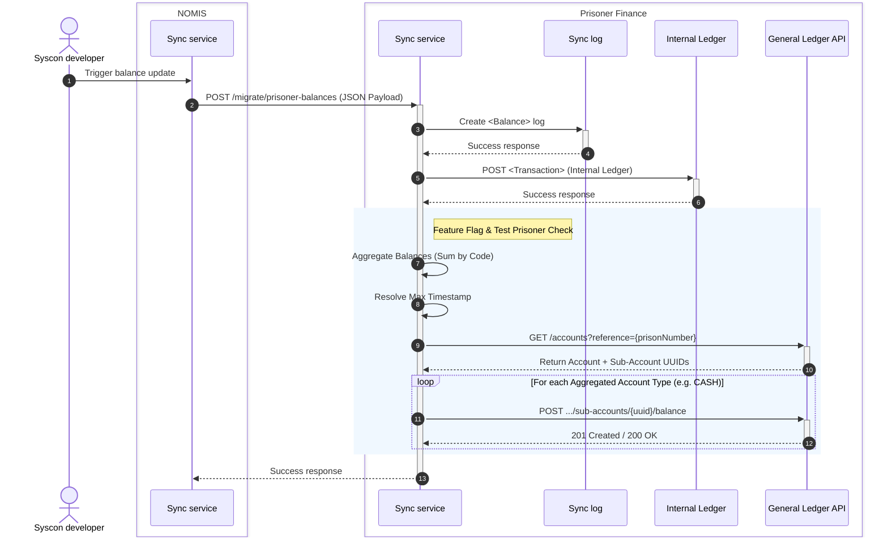
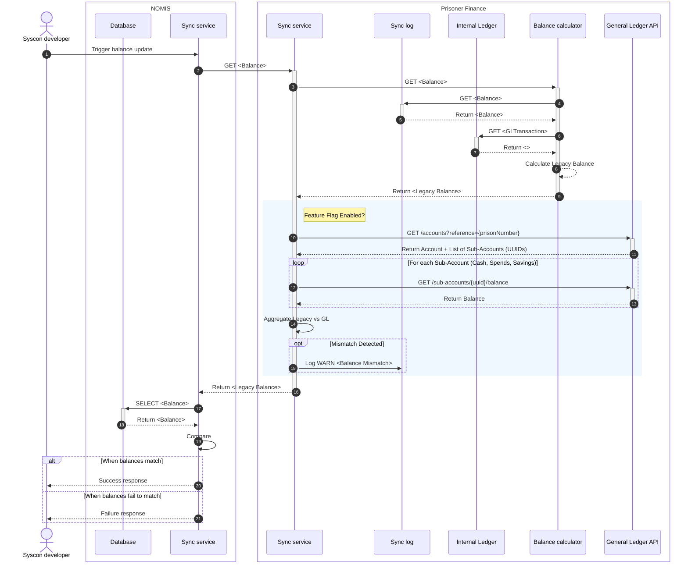
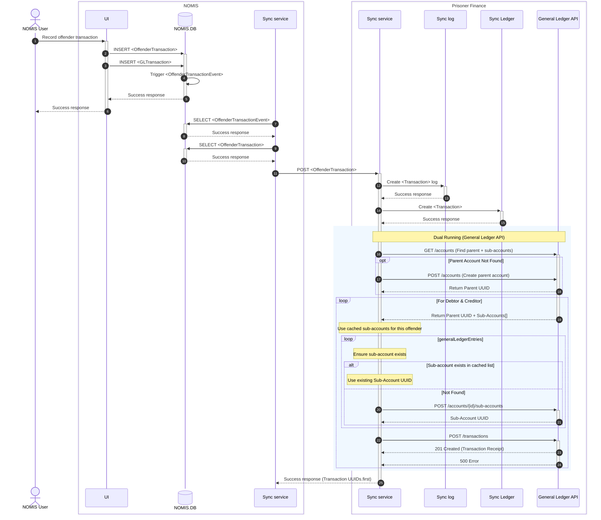

# Sync from NOMIS

The sync service will need to be able to write batches of general ledger transactions to the service and batches of 
offender transactions. This will happen everytime a new batch of transactions is written to the NOMIS database via 
table events.

The sync service will also need to be able to write balances for each general ledger account, and offender subaccount, to 
the service with a timestamp and transaction id so that the service knows when this balance was correct and which 
transactions are included in the calculated balance. 

## Migrate Balance

### Verify current balance

## Sync Offender Transaction

When a transaction involves either a credit to a prisoners subaccount or a debit from the prisoners subaccount, both an
`OffenderTransaction` record and two `GLTransaction` records are created in one database transaction.

The `OffenderTransaction` records is created to show the movement of money into or out of the prisoner's subaccount.

Two `GLTransaction` records are created to show the movement of money between the prisons overall budget for the collective prisoner 
subaccounts and the General Ledger account configured for the transaction type.

**NOTE:** *When an `OffenderTransaction` record is created to transfer money between two prisoner subaccounts, two mirrored 
`OffenderTransaction` records are created to show the money moving out of one subaccount and into the other subaccount 
along with the usual two `GLTransaction` records, but they will only be associated with the first `OffenderTransaction` 
the second will have no `GLTransaction` records.*

### Verify Offender transaction

Following this the NOMIS sync service will verify the balances.

## Sync General Ledger Transaction

When a transaction involves a transfer between two prison General Ledger account, only two `GLTransaction` records are 
created in one database transaction.

Two `GLTransaction` records are created to show the movement of money between the two General Ledger accounts configured 
for the transaction type.

### Verify General Ledger transaction

